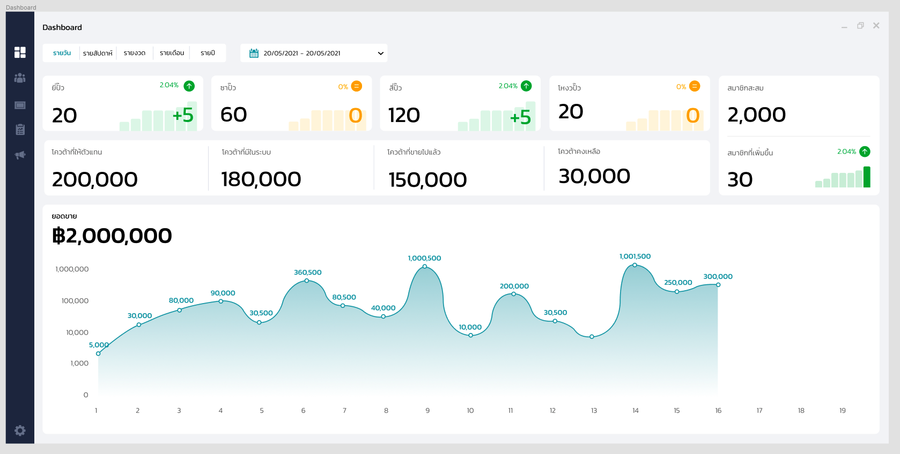
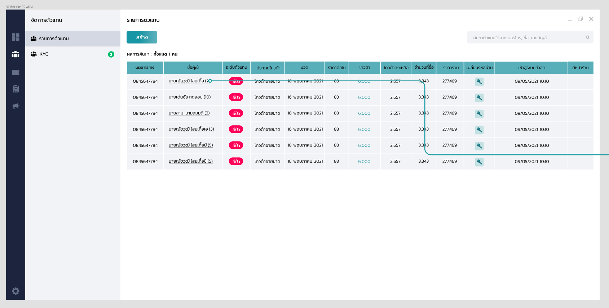
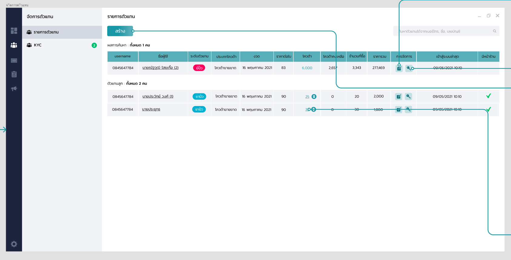
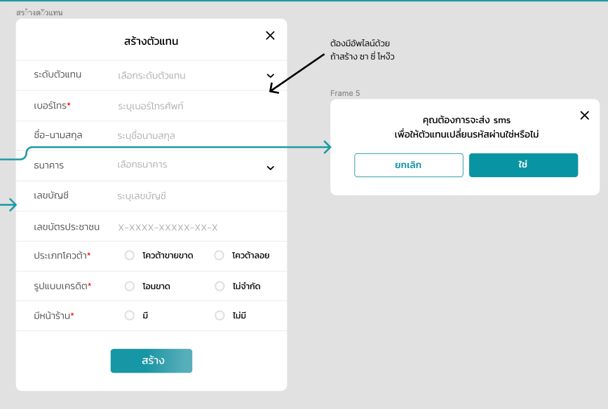
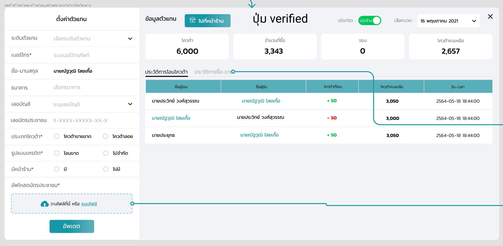
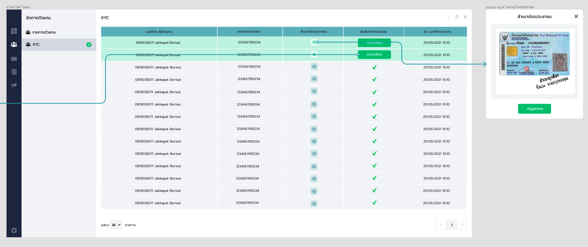
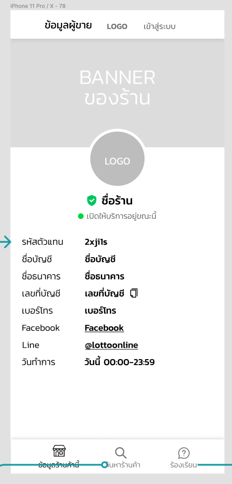

# Back Office (Lottery Online)

# About

....

# Flow

## 1. Login

...TODO...

## 2. Dashboard

- จำนวน ,ยี่ปั๊ว,ซาปั๊ว,สี่ปั๊ว,โหวงปั๊ว,สมาชิก
  (โดยแสดงการเพิ่มขึ้นไนช่วงที่ผ่านมาทั่งจำนวน และ %)
- จำนวนโควค้าที่ให้ลูกค้า/จำนวนโควต้าที่มีในระบบ
- จำนวนโควค้าในระบบ,ทั้งหมด , ขายไปแล้ว,คงเหลือ
- ยอดขาย ต่อวัน ต่องวด (แสดงเป็นตัวเลขและกราฟ)
- แนะนำเพื่อน



## 3. User Management

หน้า จัดการตัวแทน

### 3.1 รายการตัวแทน

รายการตัวแทนจะมองเห็นเป็น Layer/Hierarchy โดยจะเห็นจากเป็นลำดับชั้น ตามด้านล่าง

```
ยี่ปั้ว
├── ซาปั้ว
│ └── สี่ปั้ว
│ └── โหง้วปั๊ว
├── ซาปั้ว
│ └── โหง้วปั๊ว
└── โหง้วปั๊ว
```

- Layer #1
  

- Layer #2

  จะเห็นเป็นชื่อ Parent อยู่บนสุด ที่เหลือจะเป็น ตัวแทนลูก

  ซึ่งถ้าตัวแทนลูก มีลูกใต้สายตัวเองจะแสดงเป็น

  ```
  ชื่อ-นามสกุล (จำนวนลูก)
  ```

  

#### เพิ่มตัวแทน

- ระดับตัวแทน

  1. ยี่ปั้ว
  2. ซาปั้ว
  3. สี่ปั้ว (ต้องเพิ่ม Fields "อัพไลน์")
  4. โหง้วปั๊ว (คือ ลูกค้าที่ซื้อ lottery เยอะๆ หรือ ลูกค้ารายใหญ่)

สมมติว่าเราเป็นตัวแทนที่เป็นยี่ปั๊ว ถ้าจะมาเพิ่มตัวแทนต่อล่างเรา ที่เป็นซาปั๊ว ก็ไม่ต้องกรอกอัพไลน์ เพราะอัพไลน์ก็คือเรา
แต่ถ้าเราจะสร้างตัวแทน สี่ปั๊ว ก็จะต้องเลือกอัพไลน์ กรอกเบอร์บัญชีลอตเตอรี่ออนไลน์ของ ซาปั๊ว ด้วย



- ประเภทโควต้า

  - **โควต้าขายขาด**

    โควต้าขายขาด คือ จ่ายเงินก่อน ซื้อ 100 โควต้า ก็จะตัด โควต้าจาก ยี่ปั๊วเลย 100 โควต้า

    ถ้าเลือก "โควต้าขายขาด" รูปแบบเครดิตเลือกได้แค่ "โอนขาด"

  - **โควต้าลอย**

    โควต้าลอย คือ จ่ายเงินทีหลัง

    ถ้าเลือก "โควต้าลอย" รูปแบบเครดิตสามารถเลือกได้ทั้ง "โอนขาด" และ "ไม่จำกัด"

- รูปแบบเครดิต

  - **โอนขาด**

    โควต้า โอนขาด = โควต้าขายขาด (สามารถสร้างลูกได้) จะขึ้นเครดิตเริ่มต้น = "0"

  - **ไม่จำกัด**

    โควต้าลอย ไม่จำกัด จะขึ้นเป็น "∞" (ไม่สามารถสร้างลูกได้)

#### ตั้งค่าตัวแทน



### 3.2 KYC

Approve ร้านค้า เพื่อให้ โล่ ว่าร้านค้านี้ได้ผ่านการตรวจสอบแล้ว (Verified)





## Lottery Management

จัดการสลาก

#### นำเข้าสลาก

...TODO... (Dev)

#### สลากที่่เผยแพร่

...TODO... (Dev)

#### ค้นหาสลาก

...TODO... (Dev)

#### ประวัติการนำเข้า

...TODO... (Dev)

## Report

#### รายงานการเงิน

...TODO... (Customer)

#### รายงานตามสมาชิก

...TODO... (Customer)

#### รายงานคนที่ถูกรางวัล

...TODO... (Customer)

## Information

#### Promote Management

จัดการประกาศ
...TODO... (Dev)

#### Direct Message

ข้อความถึงลูกค้า
...TODO... (Dev)

#### Marketing

ภาพส่งเสริมการขาย
...TODO... (Dev)

#### Setting

ภาพส่งเสริมการขาย
...TODO... (Dev)
