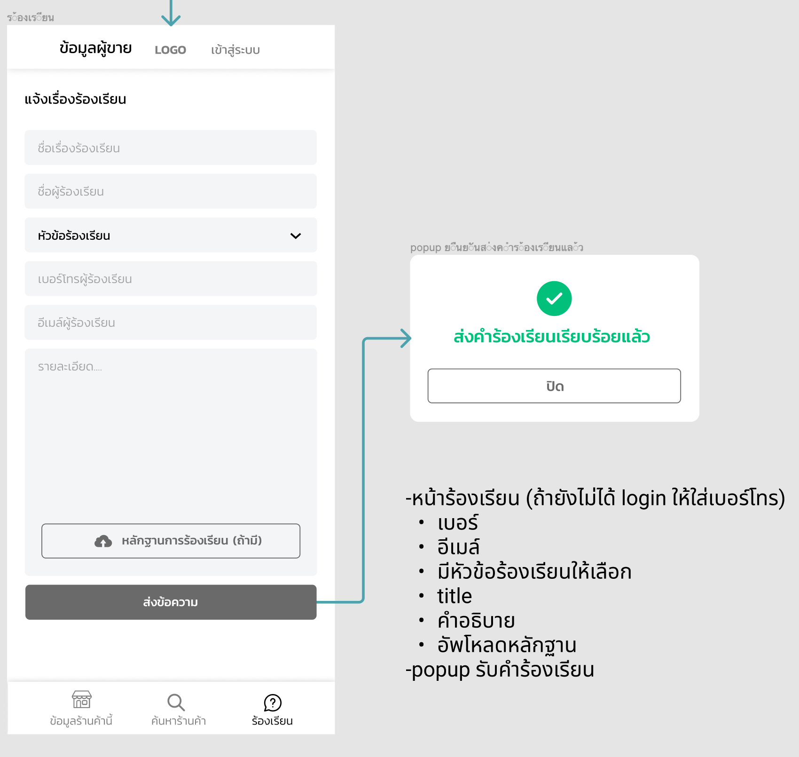

# Shop (Lottery Online)

# About

This project is the backend for Lottery Online.

....

# Flow

## 1. Search lottery

Input : 6 digit for search. (\_ \_ \_ \_ \_ \_)

Filter: ทั้งหมด / ชุด 2 ใบ / ชุด 3 ใบ / ชุด 4 ใบ (default: ทั้งหมด)

Note: การที่จะมี lottery ขึ้นมาต้องมีการ add ร้านค้าอย่างน้อย 1 ร้าน ก็จะสามารถหา lottery ทั้งหมดที่มีใน platform ได้ โดยถ้าปัดไปทางขวา `ข้อมูลผู้ขาย` จะเป็นรายละเอียดของร้านค้าที่เปิดล่าสุด

- _ทั้งหมด_ : show lottery ทุกใบโดยแบ่งทั้ง 1 ใบ, 2 ใบ, 3 ใบ, 4 ใบ, 5 ใบ (ถ้าเป็นชุด ก็ใส่ สัญลักษณ์ ไปในรูป lottery ด้วย)

- _ชุด 2 ใบ_ : show lottery เฉพาะชุด 2 ใบ (ถ้าเป็นชุด ก็ใส่ สัญลักษณ์ ไปในรูป lottery ด้วย)

- _ชุด 3 ใบ_ : show lottery เฉพาะชุด 3 ใบ (ถ้าเป็นชุด ก็ใส่ สัญลักษณ์ ไปในรูป lottery ด้วย)

- _ชุด 4 ใบ_ : show lottery เฉพาะชุด 4 ใบ (ถ้าเป็นชุด ก็ใส่ สัญลักษณ์ ไปในรูป lottery ด้วย)

ถ้าหากรัานปิด หรือ หมดแผงต้องแสดงดังนี้

## 2. Add Shop

เพิ่มร้านค้าเพื่อที่จะซื้อ Lottery โดยการมีร้านค้าหลายๆ ร้านจะได้ benefit ที่แตกต่างกัน ได้แก่

- Credit ในการซื้อ Lottery
- Fee ค่าบริการที่แตกต่างกัน

## 3. Complaint

แจ้งเรื่องร้องเรียน

## 4. Shopping Cart (Real Time)

เมื่อเลือก lottery ใส่ `ตะกร้า` ระบบจะต้องทำการ ตรวจสอบว่า lottery นั้นๆ มีการซื้อหรือยัง ? (Real-time) ซึ่งเราจะ `จอง lottery` ก็ต่อเมื่อ ไปถึงหน้า `แจ้งการชำระเงิน หรือ มี หมายเลขออเดอร์` ขึ้นแล้ว **ซึ่ง _Credit ของผู้ขายก็ยังไม่ถูกตัด_**

\* ถึง lottery ถ้าอยู่ใน Cart แล้ว ยังไม่ถือว่าจอง lottery นั้นแล้ว

ในส่วนของเงื่อนไข หรือ bussiness logic ของ Choice ในการเลือกซื้อของจำนวนใบแต่ละแบบ ได้แก่

- Switch case #1: 6 ใบ

เลือกซื้อได้ `6,3,2` ใบ

- Switch case #1: 5 ใบ

เลือกซื้อได้ `5,3,2` ใบ

- Switch case #2: 4 ใบ

เลือกซื้อได้ `4,2` ใบ

- Switch case #3: 3 ใบ

เลือกซื้อได้ `3` ใบ

- Switch case #4: 2 ใบ

เลือกซื้อได้ `2` ใบ

- Switch case #5: 1 ใบ

เลือกซื้อได้ `1` ใบ

## 5. Register & Login with OTP

...TODO... (Dev)

## 6. Confirm Payment

ถ้าหากเข้ามาถึงหน้า "แจ้งการชำระเงิน" แล้ว lottery ทั้งหมดจะถูกจอง แล้วจะมีการนับเวลาถอยหลังเป็นเวลา 1 ชั่วโมง และจะตัด Credit ของผู้ขาย คนนั้นๆ

## 7. Safe

ตู้เซฟสมาชิก จะมองเห็นในมุมมองของประวัติแบบต่างๆ

- งวดปัจจุบัน
- ประวัติการสั่งซื้อทั้งหมด
- ประวัติการถูกรางวัล
- ข้อมูลสมาชิก

### 7.1 งวดปัจจุบัน

สถานะ ของ Order

- **ยังไม่ชำระเงิน** (สีแดง)
- **หมดเวลา** (สีเทา)
- **รอตรวจสอบการชำระเงิน** (สีส้ม)
- **ยกเลิก** (สีแดง)
- **การสั่งซื้อเสร็จสมบูรณ์** (สีเขียว)

สถานะ ของ Lottery

- ไม่ถูกรางวัล (สีแดง)
- ถูกรางวัล (สีเขียว)
- ไม่ได้ชำระเงิน (สีเทา)

### 7.2 ประวัติการถูกรางวัล

สถานะ ของ Lottery ที่ถูกรางวัล

- สำเร็จ
- รอมารับ

