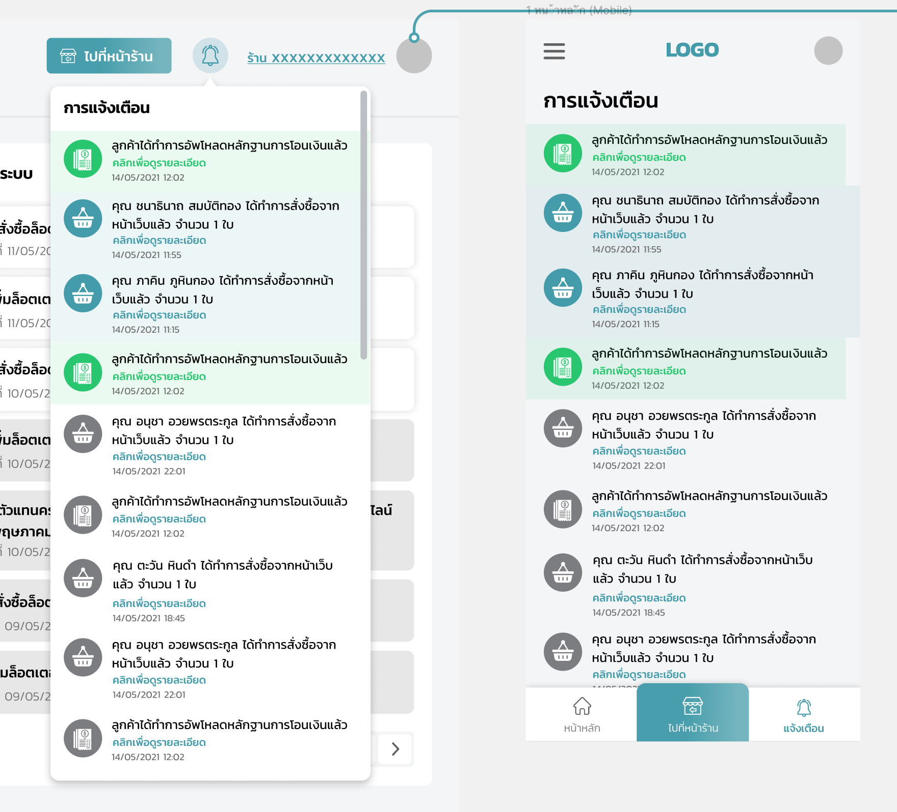

# Shop Management (Lottery Online)

# About

....

# Flow

## 1. Login

...TODO...

## 2. Announcement from platform

ประกาศจากระบบ มีหัวข้ออยู่ 3 ประเภท

- ทั่วไป
- อัพเกรดระบบ
- ข้อความ (DM-DirectMessage from admin)

## 3. Promote

Upload เกี่ยวกับ Assets หรือ Resource ที่ต้องการนำไปใช้งานต่อทางการตลาด

### 3.1 ลิ้งค์โปรโมต

ลิ้งค์โปรโมต จะเกิดจาก www._{domain-name}_/_{shopID}_

### 3.2 ภาพสำหรับเว็บ

ประเภท

- Desktop Website
  - หน้าหลัก
  - หน้าตะกร้า
- Mobile App
  - หน้าหลัก
  - หน้าข้อมูลผู้ขาย
  - หน้าล็อกอิน/เข้าสู่ระบบ
  - หน้าตู้เซฟสมาชิก

### 3.3 ภาพสำหรับไลน์

ประเภท

- Rich Message
- Rich Menu

## 4. Notification

สถานะที่ Notification

- ทำการสั่งซื้อจากหน้าเว็บแล้ว จำนวน xx ใบ (สีน้ำเงิน/สีเทา - กรณีกดดูแล้ว)
- ลูกค้าได้ทำการอัพโหลดหลักฐานการโอนเงินแล้ว (สีเขียว/สีเทา - กรณีกดดูแล้ว)

## 5. Search lottery

Input : 6 digit for search. (\_ \_ \_ \_ \_ \_)

Filter: ทั้งหมด / ชุด 2 ใบ / ชุด 3 ใบ / ชุด 4 ใบ (default: ทั้งหมด)

## 6. Shopping Cart (Real Time)

เมื่อเลือก lottery ใส่ `ตะกร้า` ระบบจะต้องทำการ ตรวจสอบว่า lottery นั้นๆ มีการซื้อหรือยัง ? (Real-time) ซึ่งเราจะ `จอง lottery` ก็ต่อเมื่อ ไปถึงหน้า `แจ้งการชำระเงิน หรือ มี หมายเลขออเดอร์` ขึ้นแล้ว **ซึ่ง \_Credit ของผู้ขาย จะถูกตัดทันที**\_

\* ซึ่งจะไม่มีเวลากำหนดในการจอง ไม่เหมือน Cart ของร้านค้า

## 7. Confirm Payment

ประเภทการชำระเงิน

...TODO... (Is K'Best confirm?)

- **จองไว้ก่อน, จ่ายเงินทีหลัง**: กรณีที่ลูกค้าโทรมาจอง หรือ ไลน์มาจอง ซึ่งจะตัด credit ของผู้ขายทันที (เนื่องจากเจ้าของ Platform มองว่า ผู้ขายต้องไม่อยากเสีย Credit ฟรีๆ อยู่แล้ว ดังนั้นหมายความว่าผู้ขายต้องมั่นใจอยู่แล้วว่าขาย lottery ได้แน่นอน)
- **ได้รับเงินแล้ว**: กรณีที่ลูกค้าโอนเงินมีสลิปแล้ว

## 8. Order

หน้าคำสั่งซื้อจะดูเป็น งวดๆ โดย default จะเริ่มที่งวดปัจจุบัน

สถานะของ Order

- **ยังไม่ชำระเงิน** (สีแดง)
- **หมดเวลา** (สีเทา) -> ซึ่งถ้าเป็นหน้าของลูกค้า จะแสดงผลเป็นคำว่า **ยกเลิกโดยระบบอัตโนมัติ**
- **รอตรวจสอบการชำระเงิน** (สีส้ม)
- **การสั่งซื้อเสร็จสมบูรณ์** (สีเขียว)

ประเภท (ของผู้ซื้อ)

- **ลูกค้า**
- **ตัวแทน**

## 9. Confirm Payment (by Admin)

ทุกๆ Order ต้องมีการยืนยันสถานะ คำสั่งซื้อ / ยกเลิกการจอง เนื่องจาก Order ถูกสร้างขึ้นได้ 2 รูปแบบหลักๆ คือ

**9.1 ลูกค้าสร้าง Order**

sadsad

**9.2 ตัวแทนสร้าง Order**
