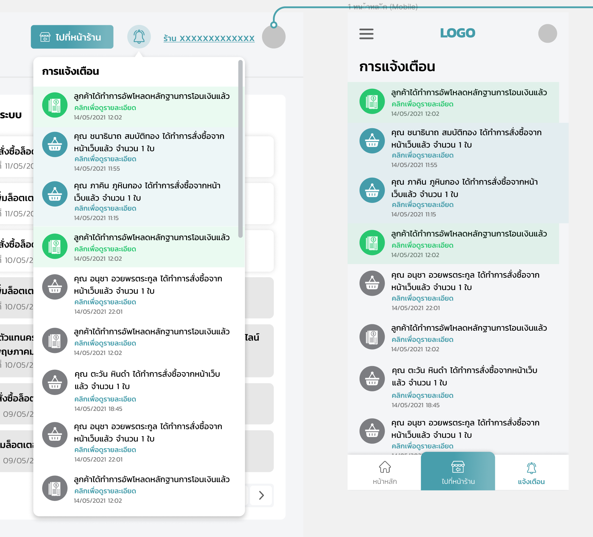

# Shop Management (Lottery Online)

# About

....

# Flow

## 1. Login

...TODO...

## 2. Announcement from platform

ประกาศจากระบบ มีหัวข้ออยู่ 3 ประเภท

- ทั่วไป
- อัพเกรดระบบ
- ข้อความ (DM-DirectMessage from admin)

## 3. Promote

Upload เกี่ยวกับ Assets หรือ Resource ที่ต้องการนำไปใช้งานต่อทางการตลาด

### 3.1 ลิ้งค์โปรโมต

ลิ้งค์โปรโมต จะเกิดจาก www._{domain-name}_/_{shopID}_

### 3.2 ภาพสำหรับเว็บ

ประเภท

- Desktop Website
  - หน้าหลัก
  - หน้าตะกร้า
- Mobile App
  - หน้าหลัก
  - หน้าข้อมูลผู้ขาย
  - หน้าล็อกอิน/เข้าสู่ระบบ
  - หน้าตู้เซฟสมาชิก

### 3.3 ภาพสำหรับไลน์

ประเภท

- Rich Message
- Rich Menu

## 4. Notification

สถานะที่ Notification

- ทำการสั่งซื้อจากหน้าเว็บแล้ว จำนวน xx ใบ (สีน้ำเงิน/สีเทา - กรณีกดดูแล้ว)
- ลูกค้าได้ทำการอัพโหลดหลักฐานการโอนเงินแล้ว (สีเขียว/สีเทา - กรณีกดดูแล้ว)

